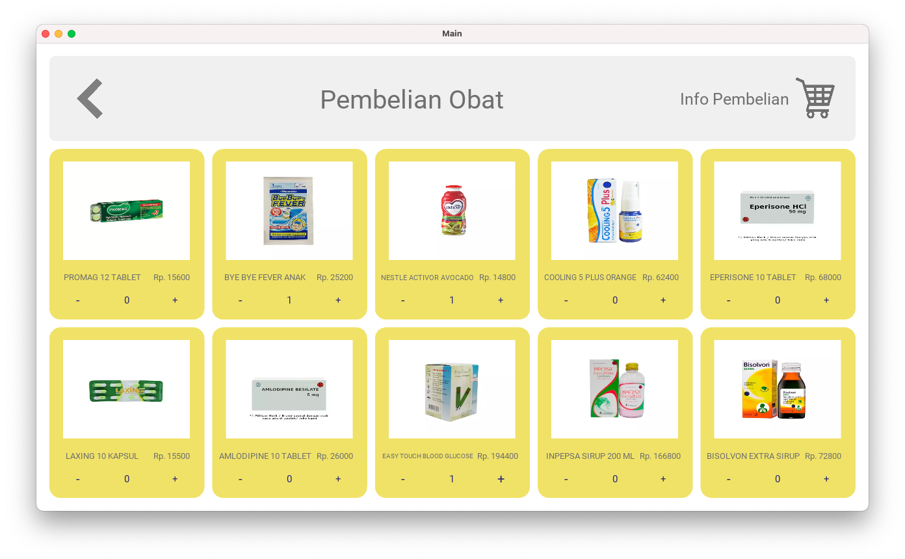

# IF2250-2021-K02-10-Clinican
Implementasi Perancangan Perangkat Lunak Clinican
IF2250 - Rekayasa Perangkat Lunak

## Author
- Syarifah Aisha Geubrina Yasmin (13519089)
- Sharon Bernadetha Marbun (13519092)
- Aulia Adila (13519100)
- Shifa Salsabiila (13519106)

## 1. Penjelasan Singkat
CliniCan merupakan sebuah perangkat lunak berbasis desktop yang dirancang  untuk mendigitalisasi apotek yang dimiliki oleh klien. Secara umum, fitur yang disediakan oleh perangkat lunak ini dapat mengakomodasi kegiatan yang dilakukan di apotek tersebut. Terdapat empat fitur utama yang harus dimiliki oleh perangkat lunak sesuai dengan permintaan klien, di antaranya adalah fitur reservasi yang mengatur pertemuan antara pasien dengan dokter, fitur pembelian obat, fitur request pembuatan obat, dan fitur chat. Perangkat lunak ini dibangun menggunakan bahasa pemograman Python dengan library GUI Kivy.

## 2.1 Cara Menjalankan (tanpa executable file)
1. Install [python](https://www.python.org/downloads/)
2. Install server MySQL [MySQL](https://dev.mysql.com/downloads/installer/)
3. Install depedency GUI Kivy [Kivy](https://kivy.org/doc/stable/gettingstarted/installation.html#)
4. Install beberapa module Python dengan command di bawah ini.
```
pip install mysql-connector-python
pip install pytest
```
5. Clone/Download repository ini
6. Ubahlah konfigurasi database yang berada di beberapa file .py di bawah ini. Konfigurasi yang diubah adalah isi dari beberapa variabel (`host` , `user` , `password` , dan `database`) yang terdapat blok `mydb` sebagai berikut.
```
    mydb = mysql.connector.connect(
        host="localhost",       #diubah sesuai host instalasi server MySQL
        user="root",            #diubah sesuai user instalasi server MySQL   
        password="12345",  #diubah sesuai password instalasi server MySQL
        database="RPL"          #diubah sesuai nama skema basis data yang digunakan
    )
```
Blok kode ini terdapat dalam beberapa file sebagai berikut.
   - signin.py
   - signindokter.py
   - signinapoteker.py
   - signup.py
   - signupdokter.py
   - signupapoteker.py
   - pembelian.py
   - pembelianapoteker.py
   - payment.py

7. Masuk ke directory **src** dan *run* file main.py dengan command berikut.
```
python3 main.py
```
8. Program akan melakukan refresh database dan mengisi beberapa data dummy setiap kali di*run*
9. Jalankan program seperti biasa

## 2.1 Cara Menjalankan (dengan executable file)
1. Hanya dapat dijalankan pada **Mac OS**
2. Install depedency GUI Kivy [Kivy](https://kivy.org/doc/stable/gettingstarted/installation.html#)
3. Clone/Download repository ini
4. Ubahlah konfigurasi database yang berada di beberapa file .py di bawah ini. Konfigurasi yang diubah adalah isi dari beberapa variabel (`host` , `user` , `password` , dan `database`) yang terdapat blok `mydb` sebagai berikut.
```
    mydb = mysql.connector.connect(
        host="localhost",       #diubah sesuai host instalasi server MySQL
        user="root",            #diubah sesuai user instalasi server MySQL   
        password="12345",  #diubah sesuai password instalasi server MySQL
        database="RPL"          #diubah sesuai nama skema basis data yang digunakan
    )
```
Blok kode ini terdapat dalam beberapa file sebagai berikut.
   - signin.py
   - signindokter.py
   - signinapoteker.py
   - signup.py
   - signupdokter.py
   - signupapoteker.py
   - pembelian.py
   - pembelianapoteker.py
   - payment.py

7. Jalankan file `blabla.exe` dengan cara *double-click* file tersebut.
8. Jalankan program seperti biasa


## 3. Daftar Modul
### Modul Sign In
Penanggung jawab : Shifa
Nama File Fisik  : 
    - signin.py
    - signinapoteker.py
    - signindokter.py
#### *Screen Capture*


### Modul Sign Up
Penanggung jawab : Shifa
Nama File Fisik  : 
    - signup.py
    - signupapoteker.py
    - signupdokter.py
#### *Screen Capture*


### Modul Home Page
Penanggung jawab : Shifa
Nama File Fisik  : 
    - homeuser.py
    - homeapoteker.py
    - homedokter.py
#### *Screen Capture*


### Modul Pembelian
Penanggung jawab : Detha
Nama File Fisik  : 
    - pembelian.py
#### *Screen Capture*



### Modul Pembayaran
Penanggung jawab : Adila
Nama File Fisik  : 
    - payment.py
    - paySuccess.py
#### *Screen Capture*


### Modul Pembelian Apoteker
Penanggung jawab : Aisha
Nama File Fisik  : 
    - pembelianapoteker.py
#### *Screen Capture*


## 4. Daftar Tabel Basis Data
### 4.1 Tabel Customer
|Key| Attribute | Type |
| --- | --- | --- |
|PK | IdAkun | int(11) NOT NULL |
|   | Nama | varchar(255) DEFAULT NULL |
|   | Email | varchar(255) DEFAULT NULL |
|   | NoTelp | varchar(20) DEFAULT NULL |
|   | Username | varchar(255) DEFAULT NULL |
|   | Password | varchar(255) DEFAULT NULL |

### 4.2 Tabel Apoteker
|Key| Attribute | Type |
| --- | --- | --- |
|PK | IdApoteker | int(11) NOT NULL |
|   | Nama | varchar(255) DEFAULT NULL |
|   | Email | varchar(255) DEFAULT NULL |
|   | NoTelp | varchar(20) DEFAULT NULL |
|   | Username | varchar(255) DEFAULT NULL |
|   | Password | varchar(255) DEFAULT NULL |

### 4.3 Tabel Dokter
|Key| Attribute | Type |
| --- | --- | --- |
|PK | IdDokter | int(11) NOT NULL |
|   | Nama | varchar(255) DEFAULT NULL |
|   | Email | varchar(255) DEFAULT NULL |
|   | NoTelp | varchar(20) DEFAULT NULL |
|   | Username | varchar(255) DEFAULT NULL |
|   | Password | varchar(255) DEFAULT NULL |

### 4.4 Tabel Obat
|Key| Attribute | Type |
| --- | --- | --- |
|PK | IdObat | int(11) NOT NULL |
|   | NamaObat | varchar(255) DEFAULT NULL |
|   | Stok | int(11) DEFAULT NULL |
|   | Harga | int(11) DEFAULT NULL |
|   | PictObat | varchar(255) DEFAULT NULL |
|   | Deskripsi | text DEFAULT NULL |

### 4.5 Tabel Pembelian
|Key| Attribute | Type |
| --- | --- | --- |
|PK | IdTransaksi | int(11) NOT NULL |
|PK | IdAkun | int(11) NOT NULL |
|PK | IdObat | int(11) NOT NULL |
|   | Kuantitas | int(11) DEFAULT NULL |
|   | HargaKumu | int(11) DEFAULT NULL |

### 4.6 Tabel Transaksi
|Key| Attribute | Type |
| --- | --- | --- |
|PK | IdTransaksi | int(11) NOT NULL |
|PK | IdAkun | int(11) NOT NULL |
|PK | IdObat | int(11) NOT NULL |
|   | Kuantitas | int(11) DEFAULT NULL |
|   | HargaKumu | int(11) DEFAULT NULL |
